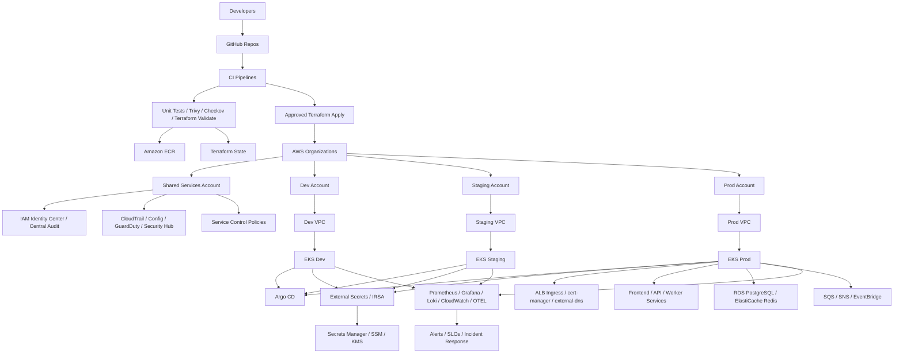

# AWS Architecture

## Objective
Build a production-style AWS platform for the same regulated workload using multi-account governance, secure networking, EKS, GitOps, observability, and resilience patterns.

## Architecture Layers
- organization and identity
- network and ingress
- platform shared services
- Kubernetes workloads
- observability and security
- data and messaging
- CI/CD and GitOps

## Detailed AWS Resource Landscape

## Recommended AWS Services
- `AWS Organizations`
- `IAM Identity Center`
- `CloudTrail`
- `AWS Config`
- `GuardDuty`
- `Security Hub`
- `VPC`
- `EKS`
- `ECR`
- `Secrets Manager`
- `KMS`
- `RDS PostgreSQL`
- `ElastiCache Redis`
- `CloudWatch`
- `SQS`, `SNS`, or `EventBridge`

## Senior Design Decisions To Practice
- separate shared services, audit, and workload concerns by account
- enforce least privilege with role assumptions and scoped automation roles
- use IRSA for Kubernetes workloads
- centralize security and audit visibility
- make production changes auditable and approval-driven

## Portfolio Artifacts To Capture
- account architecture diagram
- VPC and subnet segmentation diagram
- EKS baseline module layout
- SCP and identity model notes
- security findings and remediations
- dashboard and incident drill evidence

