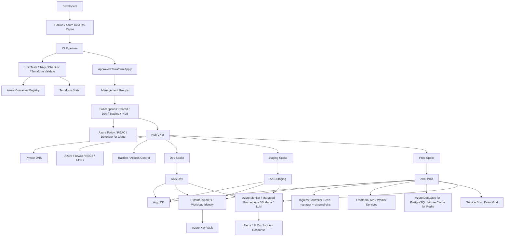

# Azure Architecture

## Objective
Build a production-style Azure platform for a regulated microservices workload using governance-first design, secure networking, AKS, GitOps, observability, and resilience patterns.

## Architecture Layers
- governance and identity
- network and ingress
- platform shared services
- Kubernetes workloads
- observability and security
- data and messaging
- CI/CD and GitOps

## Detailed Azure Resource Landscape

## Recommended Azure Services
- `Management Groups`
- `Azure Policy`
- `Microsoft Entra ID` and RBAC
- `Azure Key Vault`
- `Azure Container Registry`
- `AKS`
- `Azure Monitor`
- `Managed Prometheus` and `Managed Grafana` if desired
- `Azure Database for PostgreSQL`
- `Azure Cache for Redis`
- `Service Bus` or `Event Grid`
- `Private DNS`
- `Azure Firewall`

## Senior Design Decisions To Practice
- separate shared services from workload environments
- default to private endpoints where sensible
- use workload identity instead of embedded credentials
- centralize logging and policy enforcement
- keep production promotion gated and observable

## Portfolio Artifacts To Capture
- management group and subscription model diagram
- network segmentation diagram
- AKS baseline module layout
- policy definitions and assignments
- Grafana screenshots
- incident and restore drill notes

