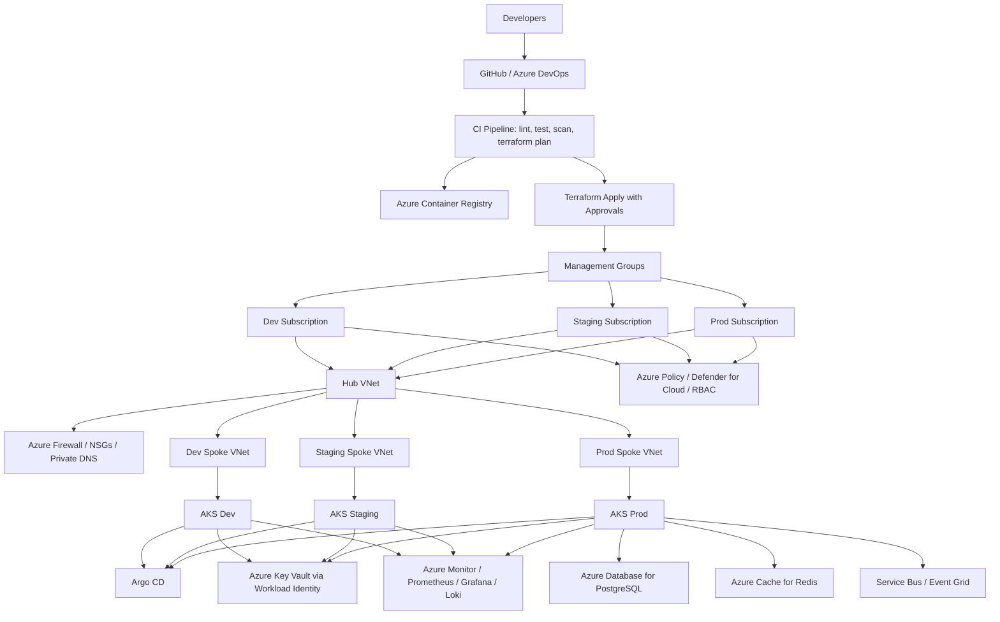
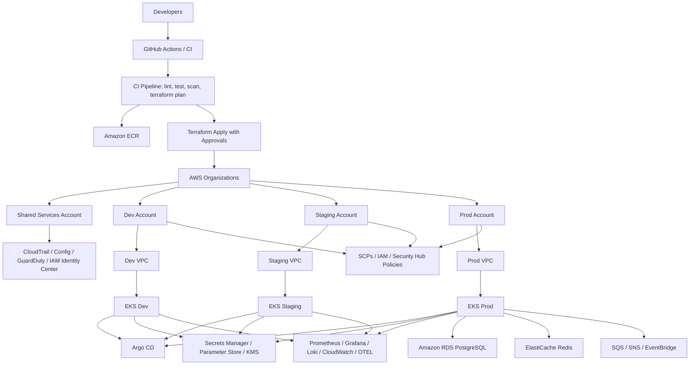

# Senior DevOps Acceleration Plan for Uchenna

## Goal
Move from an Azure-strong DevOps/DevSecOps engineer into a senior multi-cloud platform engineer with real implementation artifacts in both Azure and AWS.

This plan is tailored to your resume:
- Strong existing base: Azure, Terraform, AKS, Kubernetes, Ansible, Azure DevOps, security tooling, migration work
- Biggest senior-level growth opportunities: AWS platform depth, GitOps, platform engineering, SRE practices, multi-account landing zones, policy-as-code, observability, DR patterns, cost governance, and production-grade release engineering

## Positioning Strategy
Do not present this as fake employment.

Present it as:
- `Independent Senior DevOps Platform Engineering Lab`
- `Multi-Cloud Platform Engineering Capstone`
- `Production-Style DevSecOps Transformation Project`

That keeps it ethical while still giving you credible hands-on project experience you can discuss in interviews.

## Program Structure
Duration: 12 weeks

Effort:
- 12 to 15 hours per week minimum
- 18 to 22 hours per week if you want to compress it aggressively

Output by the end:
- One Azure implementation
- One AWS implementation
- Shared reusable Terraform modules
- GitOps delivery flow
- Observability stack
- Security and policy controls
- Runbooks, diagrams, CI/CD pipelines, and incident simulation notes

## Senior-Level Target Outcomes
By the end of this program, you should be able to speak confidently about:
- Designing enterprise landing zones
- Building reusable IaC modules and promotion workflows
- Running Kubernetes with GitOps and policy enforcement
- Implementing zero-trust secrets and workload identity patterns
- Operating multi-environment CI/CD with quality gates
- Building SRE-style observability, SLOs, and incident response
- Implementing cost visibility, backup, and disaster recovery patterns
- Leading architecture decisions instead of only executing tickets

## Tools To Master In This Plan
Because your resume already covers several core tools, the emphasis here is on the senior differentiators:

- `AWS Organizations`, `Control Tower`, `IAM Identity Center`
- `Azure Management Groups`, `Azure Policy`, `Defender for Cloud`
- `Terraform`, `Terragrunt` or structured reusable module patterns
- `GitHub Actions` and `Azure DevOps` for comparative pipeline design
- `EKS`, `AKS`
- `Argo CD`
- `Helm`, `Kustomize`
- `External Secrets Operator`
- `HashiCorp Vault` or cloud-native secret managers
- `Prometheus`, `Grafana`, `Loki`, `Tempo` or managed equivalents
- `OpenTelemetry`
- `Kyverno` or `OPA Gatekeeper`
- `Trivy`, `Checkov`, `tfsec`, `Snyk` if available
- `Falco` or cloud-native runtime threat tooling
- `Backstage` optional but valuable for platform engineering maturity

## The Capstone You Will Build
Build the same business platform twice:
- Once on Azure
- Once on AWS

Business scenario:
An internal developer platform hosting microservices for an e-commerce or EMR-like regulated workload, with:
- private networking
- ingress control
- CI/CD
- GitOps
- secrets management
- centralized observability
- security scanning
- policy enforcement
- backup and disaster recovery considerations

Suggested microservices:
- `frontend`
- `api-gateway`
- `patient-orders` or `inventory-service`
- `billing-service`
- `notification-worker`
- `postgres`
- `redis`

You do not need complex application code. Simple containerized demo apps are enough. The value is in the platform design and operations.

## 12-Week Course Plan

### Phase 1: Senior Foundation and Platform Design

#### Week 1: Architecture, Scope, and Landing Zone Design
Build:
- target architecture document
- naming standards
- tagging strategy
- environment model: `dev`, `staging`, `prod`
- networking plan
- identity and RBAC model
- log and metrics strategy

Deliverables:
- architecture decision record set
- repository structure
- first draft diagrams
- Terraform folder/module strategy

What you are sharpening:
- platform thinking
- environment separation
- enterprise governance design

#### Week 2: Azure Landing Zone Implementation
Build:
- management groups
- subscriptions or environment segmentation model
- virtual network with subnets
- NSGs and route design
- Log Analytics workspace
- Key Vault
- Azure Container Registry
- AKS baseline
- Azure Policy assignments

Hands-on scenarios:
- deny public IP creation except approved workloads
- require tags and approved regions
- send diagnostic logs to central workspace

Senior skill gained:
- governance-first Azure platform design

#### Week 3: AWS Landing Zone Implementation
Build:
- AWS Organizations structure
- IAM Identity Center model
- separate accounts for `shared`, `dev`, `staging`, `prod`
- VPC design
- public/private subnet design across 2 or 3 AZs
- CloudTrail
- Config
- GuardDuty
- ECR
- EKS baseline
- KMS-backed secret strategy

Hands-on scenarios:
- SCP to block unsupported regions
- centralized audit logging
- least-privilege role strategy for CI/CD and platform ops

Senior skill gained:
- multi-account AWS platform governance

### Phase 2: Delivery Engineering and GitOps

#### Week 4: CI/CD and IaC Promotion Pipeline
Build:
- GitHub Actions pipeline for Terraform validation, plan, policy checks, and apply gates
- Azure DevOps variant if you want comparative tooling on your resume
- branch strategy
- state management
- manual approval for production

Include:
- `terraform fmt`
- `terraform validate`
- `tflint`
- `checkov`
- artifact versioning

Senior skill gained:
- controlled infrastructure promotion and compliance gates

#### Week 5: Kubernetes Platform Baseline
Build on both AKS and EKS:
- ingress controller
- cert-manager
- external-dns
- cluster autoscaling
- workload identity
- namespaces per environment/team
- resource quotas and limit ranges

Also implement:
- pod security standards
- network policies
- private image pull model

Senior skill gained:
- production-grade Kubernetes platform operations

#### Week 6: GitOps and Secure Release Flow
Build:
- Argo CD
- app-of-apps pattern
- Helm/Kustomize overlays
- promotion from `dev` to `staging` to `prod`
- image automation or release tagging process

Add controls:
- signed image or at least verified image scanning gate
- required pull request checks before sync

Senior skill gained:
- repeatable GitOps delivery architecture

### Phase 3: DevSecOps, Observability, and Reliability

#### Week 7: DevSecOps Hardening
Build:
- container image scanning
- IaC scanning
- secret scanning
- dependency scanning
- admission policies using `Kyverno` or `OPA`

Policy examples:
- block latest tags
- require resource limits
- block privileged containers
- require approved registries

Senior skill gained:
- shift-left and runtime guardrail design

#### Week 8: Observability and SRE Foundations
Build:
- Prometheus
- Grafana
- Loki
- alerting rules
- service dashboards
- synthetic health checks
- OpenTelemetry instrumentation for at least one service

Create:
- golden signal dashboards
- error budget view
- latency and saturation alerts

Senior skill gained:
- operating platform health with SRE language

#### Week 9: Incident Response and Resilience
Build and test:
- runbooks
- pod failure scenarios
- node failure scenarios
- region/service dependency analysis
- backup and restore drill
- secret rotation drill
- database restore simulation

Azure focus:
- backup strategy, zone-redundancy review, optional traffic failover pattern

AWS focus:
- EBS/EFS/RDS snapshot or restore simulation, multi-AZ review, Route 53 failover concept

Senior skill gained:
- reliability ownership and failure-mode leadership

### Phase 4: Advanced Platform Engineering

#### Week 10: Internal Developer Platform Experience
Build:
- reusable service onboarding template
- standardized Helm chart or app template
- developer documentation
- golden path for new service deployment

Optional advanced add:
- Backstage software catalog
- scorecards
- service ownership metadata

Senior skill gained:
- platform engineering, not just infrastructure management

#### Week 11: FinOps and Optimization
Build:
- tagging compliance dashboard
- cluster rightsizing recommendations
- storage class and node pool optimization notes
- cost comparison between Azure and AWS environments

Track:
- idle resources
- egress considerations
- overprovisioned requests/limits

Senior skill gained:
- engineering with cost accountability

#### Week 12: Executive Packaging and Resume-Ready Evidence
Produce:
- final architecture diagrams
- implementation walkthrough
- incident drill report
- security control matrix
- cost optimization summary
- GitHub portfolio README
- resume bullet points
- interview story bank using STAR format

Senior skill gained:
- communicating technical leadership and platform outcomes

## Resource Landscape: Azure Version



## Resource Landscape: AWS Version



## What Makes This Resume-Worthy
The following artifacts turn the project from a lab into credible senior-level evidence:

- architecture diagrams for Azure and AWS
- Terraform module library
- CI/CD pipelines with approvals and policy checks
- GitOps deployment repo
- security control matrix
- observability dashboards
- incident runbooks
- DR test notes
- cost optimization report
- service onboarding template

## Suggested Repository Layout

```text
platform-engineering-capstone/
  docs/
    architecture/
    runbooks/
    adr/
  terraform/
    modules/
    azure/
    aws/
  kubernetes/
    base/
    overlays/
  gitops/
    apps/
    clusters/
  services/
    frontend/
    api/
    worker/
  observability/
    grafana/
    alerts/
  security/
    policies/
    scans/
```

## Weekly Evidence Checklist
Every week, produce visible artifacts.

Required evidence:
- screenshots
- pull requests
- diagrams
- Terraform plans and applies
- pipeline results
- dashboard captures
- brief implementation notes

This matters because senior interviews go better when you can say:
- what you designed
- why you chose it
- what tradeoffs you evaluated
- what failed during testing
- how you improved it

## Interview Stories You Should Be Able To Tell
By the end, prepare stories around:
- designing a multi-environment landing zone
- securing Kubernetes admission and secrets flow
- implementing GitOps promotion with rollback strategy
- building observability around SLOs and golden signals
- handling a simulated production incident
- reducing cost through rightsizing and governance
- comparing AKS and EKS operational tradeoffs

## Sample Resume Bullets You Can Use After Completion
Use truthful wording such as `Independent Project`, `Lab`, or `Capstone`.

- Designed and implemented a multi-cloud internal developer platform across Azure and AWS using Terraform, AKS, EKS, Argo CD, GitHub Actions, and cloud-native security controls.
- Built reusable infrastructure modules and governed promotion pipelines with policy checks, reducing configuration drift and standardizing environment provisioning.
- Implemented GitOps-based Kubernetes delivery with secrets integration, admission controls, image scanning, observability dashboards, and incident response runbooks.
- Established landing zone guardrails including RBAC, policy-as-code, centralized logging, workload identity, and cost governance patterns aligned to senior platform engineering practices.

## High-Value Certification Alignment
You already have strong Microsoft credentials. For this specific senior multi-cloud move, the most useful optional alignments are:
- `AWS Solutions Architect Associate` or `AWS SysOps Administrator`
- `CKA` or `CKS`
- `HashiCorp Terraform Associate` if you want an easy supporting badge

## Recommended Success Metrics
Track yourself against these:
- environment provisioning from scratch in under 90 minutes
- rollback of a faulty deployment in under 15 minutes
- secret rotation with no application outage
- alert to triage workflow documented in under 10 minutes
- one-click or one-PR promotion between environments
- policy violations blocked before production deployment

## My Recommendation Based On Your Resume
Your fastest path to senior-level differentiation is:
- keep Azure as your strongest cloud
- make AWS your credibility expansion area
- become very strong in GitOps and platform engineering
- deepen SRE, observability, and incident leadership
- package all of it as one polished multi-cloud capstone

That combination will make you look much more like a senior DevOps or platform engineer than simply adding more tools to a skills list.
